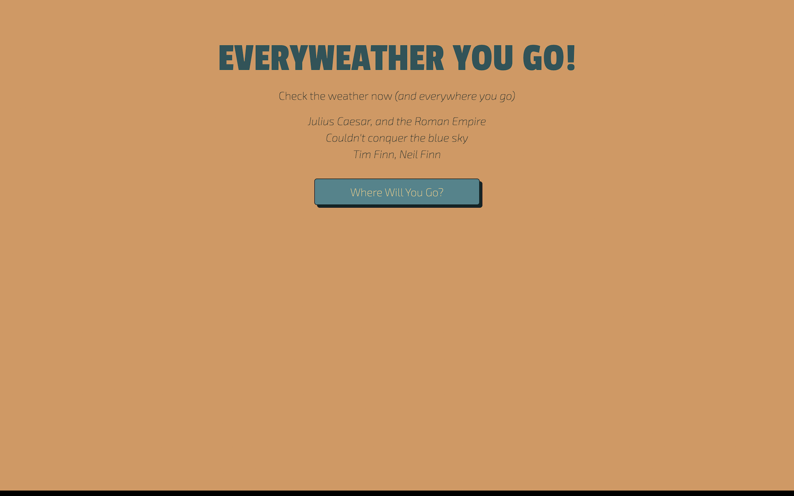
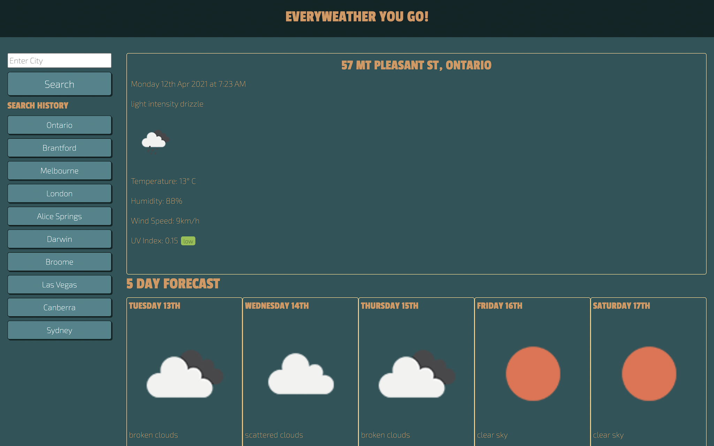
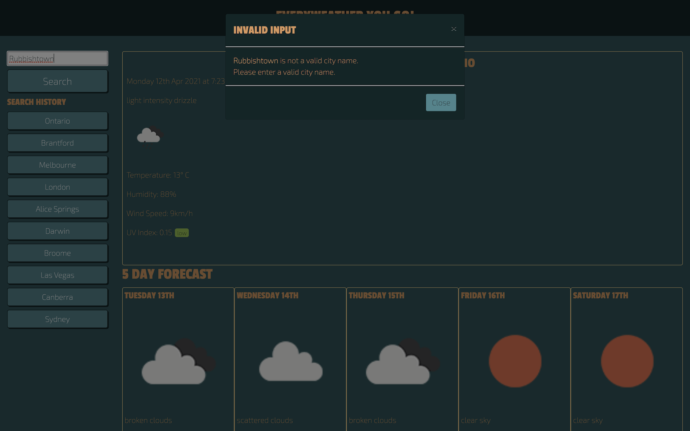
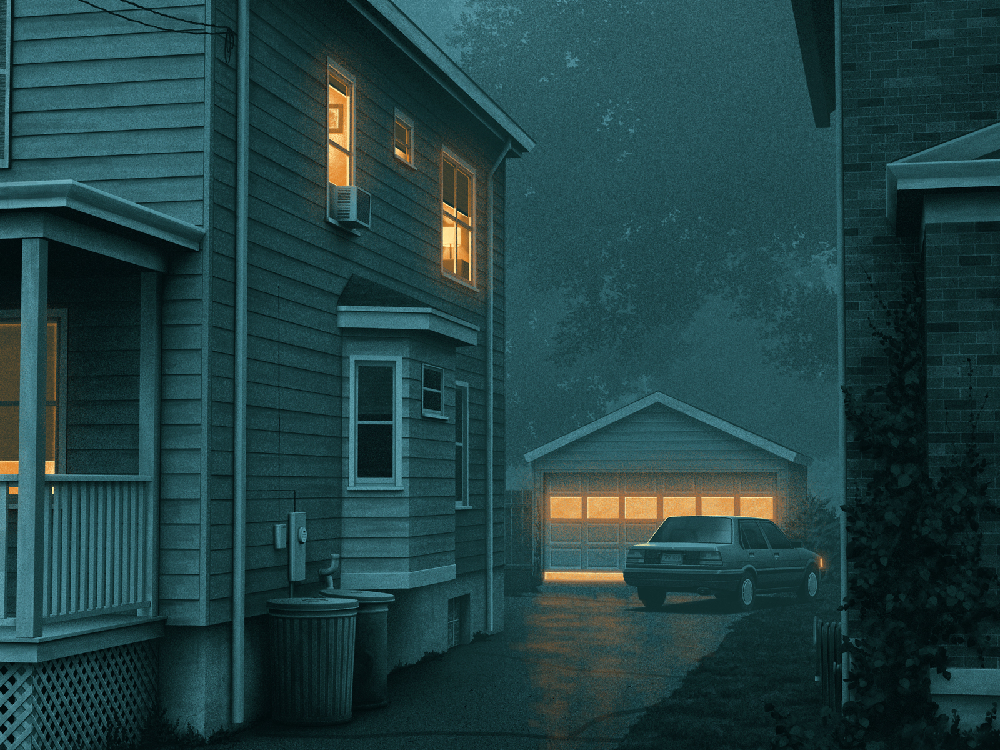
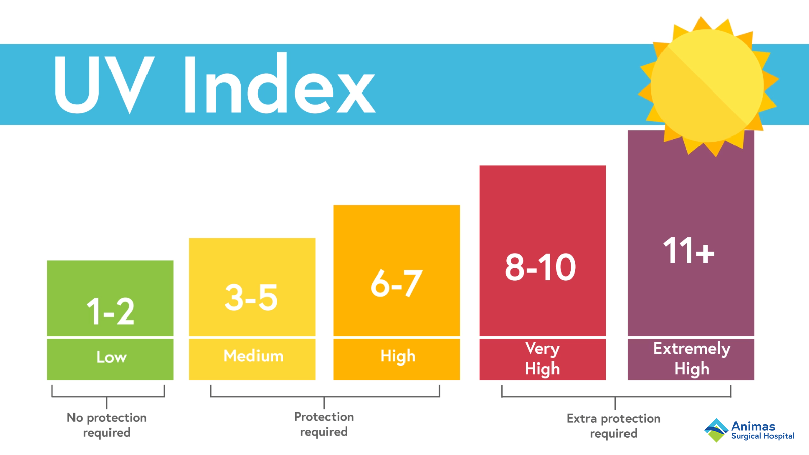

# 06-WeatherDashboard

## Description
Our client is planning on taking some time to travel the world and see the sights when COVID-19 ends.  Whilst travelling, they would like to be able to check the weather as they go to aid them in their activity & wardrobe planning.

## Criteria
- The site is a weather dashboard utilising the One-Call API from openweathermap.org
- City search form
- City search history (using localStorage)
- Weather display results:
    - Current Conditions
        - Temperature
        - Humidity
        - Wind Speed
        - UV Index (with scale - Favorable, Moderate, Severe)
    - Future Conditions (5-Day Forecast)
        - Date
        - Weather Icon
        - Temperature
        - Wind Speed
        - Humidity

## Deployment
https://mrsamlaw.github.io/06-WeatherDashboard
## Screenshots

## Psuedo Code
- User inputs city name
- Accept user input on enter key or button press
- Validate input is not empty
- Clear user input form
- Define URLSearhParams with user input
- Make OpenWeatherMap API Fetch Call to get Lat & Lon
- Make OpenWeatherMap One Call API Fetch call
- Extract required data from promise into an object with:
    - Current Conditions
        - Temperature
        - Humidity
        - Wind Speed
        - UV Index (with scale - Favorable, Moderate, Severe)
    - Future Conditions (5-Day Forecast)
        - Date
        - Weather Icon
        - Temperature
        - Wind Speed
        - Humidity
- Display object data
- Store city name in localStorage
- Event handler for previous city searches

## Further Improvements
- Wind Direction addressed
- Limit Search History shown
- Display a map of location
- Weather based on time of day

## Inspiration
The color styling was inspired by this image: A Passing View by artist Nicholas Moegly (https://dribbble.com/moegly).

The UV Index colors were sourced from this image from the Animas Surgical Hospital
(https://www.animassurgical.com/the-uv-index-and-why-you-should-care-about-it/)
